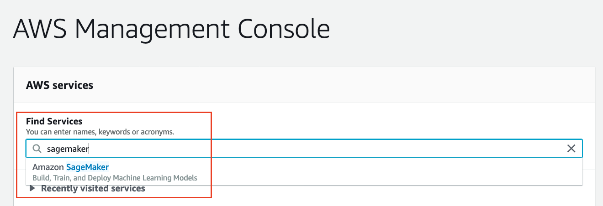
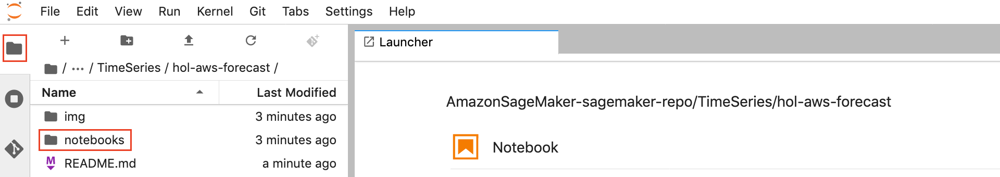

# aws-samples-forecast

## Overview
Walmart 일일 판매량을 Amazon Forecast서비스로 예측한다.

## Reference
- Kaggle M5 Forecasting - Accuracy (https://www.kaggle.com/c/m5-forecasting-accuracy)
- The Makridakis Open Forecasting Center (MOFC) at the University of Nicosia가 주최하는 5번째 Competition

## Datasets
Amazon Forecast Hands-on 에서는 총 3개의 Dataset을 사용한다.

1. **calendar.csv** - Contains information about the dates on which the products are sold.
2. **sales_train_validation.csv** - Contains the historical daily unit sales data per product and store [d_1 - d_1913]
3. **sell_prices.csv** - Contains information about the price of the products sold per store and date.

## Getting Started

### AWS Management Console에 Login

### Amazon Sagemaker Jupyter Notebook 생성
AWS CloudFormation으로 Hands-on을 수행할 Amazon Sagemaker Jupyter Notebook을 AWS N.Virginia Region에 생성한다.

<table>
<thead>

<tr>
<td align="center">N.Virginia (us-east-1)</td>
<td align="left"><a  href="https://console.aws.amazon.com/cloudformation/home?region=us-east-1#/stacks/create/review?stackName=ForecastDemoLab&templateURL=https://sagemaker-sinjoonk.s3.amazonaws.com/cloudformation/amazon-forecast.yml&amp;" target="_blank"  class="btn btn-default">
  <i class="fas fa-play"></i>
Deploy to AWS N.Virginia Region
</a>
</td>
</tr>

</tbody>
</table>

### Amazon SageMaker Service로 이동
AWS Management Console에서 "Find Services" > "Sagemaker"를 입력한 후 "Amazon SageMaker"를 클릭한다.

Amazon SageMaker Service 화면에서 좌측 "Notebook instances"를 클릭한 후 "Forecast"로 시작하는 Notebook을 선택한 후 "Open JupyterLab"을 클릭한다.

### Open JupyterLab Notebooks
JupyterLab에 로그인 한 후 좌측 상단 탐색기 버튼을 클릭하면 Hands-on에 사용할 JupyterLab Notebook을 확인할 수 있다.

- 1a.EDA-Introduction.ipynb : 기본적인 EBA
- 1b.EDA-TargetGroup.ipynb : `FOODS_3` Category에 대한 EDA
- 2.AmazonForecast.ipynb : Amazon Forecast 실습

